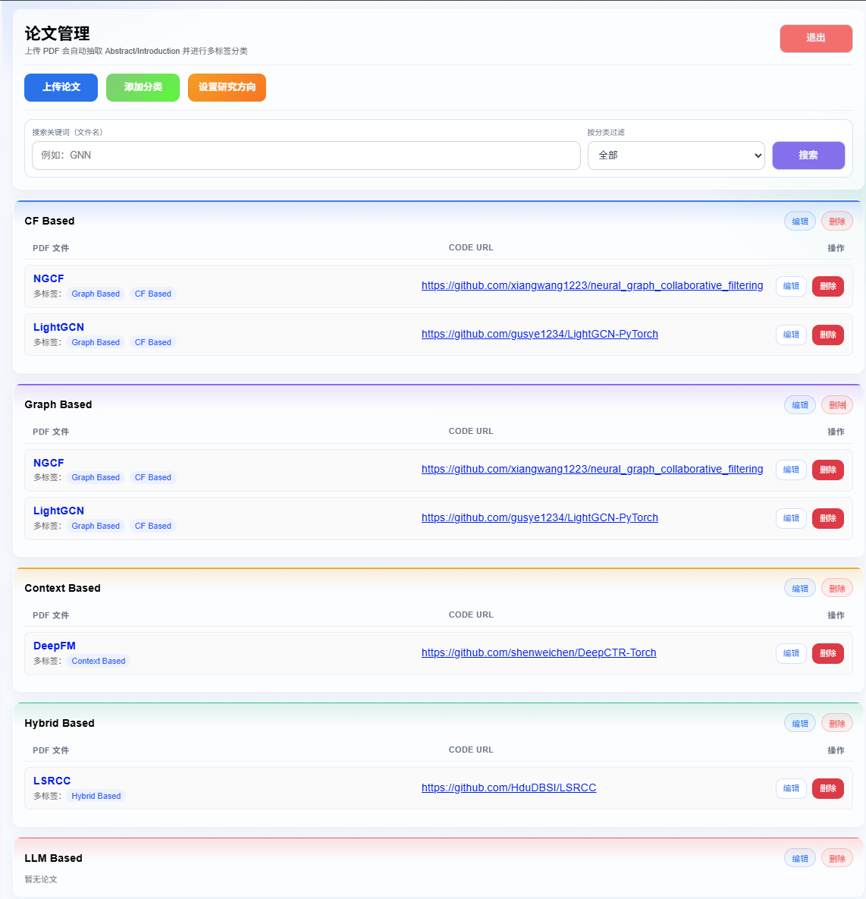

# 论文自动分类与代码关联系统

一个面向推荐系统论文管理的小型全栈项目。  
系统支持上传 PDF、自动解析内容、调用 LLM 做多标签分类，并将论文与代码仓库链接统一管理。

## 前端界面

## 项目功能概览

- 用户登录：基础账号密码登录（默认管理员可由初始化数据创建）
- 论文上传：上传 PDF 文件并保存到存储（支持本地/OSS）
- 自动分类：抽取论文 `Abstract/Introduction`，调用大模型进行多标签分类
- 分类管理：支持分类新增、编辑、删除、主题色配置、分类描述配置
- 代码链接管理：为每篇论文维护 `code_url`，支持编辑和删除论文
- 研究方向设置：可在系统中设置“研究方向”，并拼接到 LLM 提示词中提升分类准确性
- 检索与筛选：按关键词、分类筛选论文
- 预览体验：论文链接可直接打开预览（结合 OSS 签名链接与响应头实现）

## 核心业务流程

1. 用户登录后进入论文管理页面
2. 上传 PDF（可同时填写 `code_url`）
3. 后端解析 PDF 文本（Abstract/Introduction）
4. 拼接提示词（研究方向 + 分类名称 + 分类描述 + 论文内容）
5. 调用 LLM 返回分类结果（多标签）
6. 保存论文、分类关联、文件路径与代码链接到数据库
7. 前端按分类分组展示论文，并支持后续编辑/删除

## 主要模块说明

- 后端：`paper-system`（Spring Boot）
  - 认证模块：登录接口
  - 论文模块：上传、列表、编辑、删除
  - 分类模块：分类 CRUD、删除前关联校验
  - 设置模块：研究方向设置读写
  - 存储模块：本地文件与阿里云 OSS
  - LLM 模块：提示词构建、调用、结果解析与错误处理
- 前端：`paper-system/src/main/resources/static/index.html`
  - 登录页、论文管理页、分类管理弹窗、上传弹窗、研究方向设置弹窗
  - Toast 提示、筛选搜索、分组展示、主题色视觉增强

## 技术栈

- Java 17 / Spring Boot
- Spring Data JPA + MySQL
- Apache PDFBox（PDF 内容抽取）
- 阿里云 OSS SDK（对象存储）
- React（通过静态页面嵌入）
- DashScope / Qwen（LLM 分类）

## 数据模型（核心表）

- `app_user`：系统用户
- `paper`：论文主表（标题、文件路径、代码链接、创建时间）
- `category`：分类表（名称、主题色、描述）
- `paper_category`：论文与分类多对多关系
- `app_setting`：系统设置（如研究方向）

> 建表 SQL 已提供：`DB.sql`

## 项目价值

- 将“论文阅读管理 + 自动分类 + 代码追踪”整合到一个系统中
- 通过“分类描述 + 研究方向”增强 LLM 分类上下文，提升实用性
- 具备完整的前后端闭环，适合作为课程实战、毕设原型或内部工具基础版本

---

注：本项目是个人对 Vibe Coding 的一次简单实践。总体来说，Vibe Coding 的核心在于——清晰、准确地描述需求，其余交由大模型完成实现。

那么，如何更好地描述需求呢？我总结了以下几点：

1. **明确目标与场景**
    首先要清楚自己要做什么，包括核心功能、使用方式以及目标用户（是个人使用还是部署到服务器供他人使用）。可以先与 AI 进行初步交流，让其基于你的想法生成一份 PRD（产品需求文档）。
2. **审阅并完善 PRD**
    仔细阅读 AI 生成的 PRD，确认是否符合预期。对于一些功能实现，AI 可能会提供多种方案，此时需要结合自身需求进行选择，并补充或修正 AI 未考虑到的细节。
3. **确定技术栈**
    根据项目需求选择合适的技术方案，例如使用 Java 还是 Python，实现数据库选用 MySQL 还是 PostgreSQL 等。
4. **设计项目结构与规范**
    在完善 PRD 并确定技术栈后，将相关信息提供给 AI，让其生成项目整体结构，包括：
   文件结构
   模块划分
   数据表设计
   代码规范等
5. **生成项目代码**
    将 PRD 文档和项目结构信息交给工具（如 Cursor），生成初始项目代码。
6. **迭代优化**
    项目生成后，对功能和前端界面进行检查。不满意的地方可以继续让 AI 优化，但需要注意描述要具体、准确，以提高修改效果。

